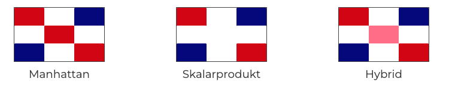
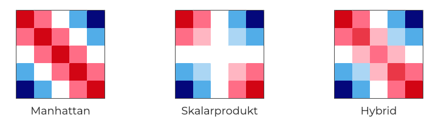
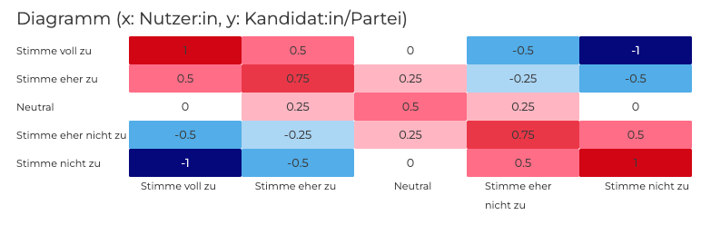

# Match Algorithmus

Der Matching Prozess von VOTO basiert standardmäßig auf einem relativ simplen aber effizienten Algorithmus, der jedoch als Creator selbst individualisiert werden kann.

Grundlegend ist eine Matrix, die sowohl Match ( Kandidat / Partei ) als auch User Entscheidungen enthält. Je nach Einstellung beträgt die Größe dieser Matrix 3\*3 oder 5\*5 Zellen.

VOTO bietet im Portal bereits drei vordefinierte Matrizen ( Manhattan/Skalarprodukt/Hybrid ). Basis dafür ist eine Masterarbeit von [Veikko Isotalo](https://aaltodoc.aalto.fi/bitstream/handle/123456789/59362/master_Isotalo_Veikko.pdf?sequence=1%26isAllowed=y).




Je nachdem, wie bei einer These abgestimmt wird, werden Punkte aus der Matrix vergeben. VOTO bietet an, jede Zelle der Matrix komplett selbst zu individualisieren, sodass der Algorithmus perfekt an die jeweiligen Bedürfnisse angepasst werden kann. Folgendes Bild zeigt ein Beispiel einer Matrix:



### Schritt 1: Kandidierende / Parteien laden

Für die angegebene Wahl werden alle Kandidierenden, die VOTO bereits ausgefüllt haben, aus der Datenbank geladen.

### Schritt 2: Berechnung der Punktzahl

Durch die dynamische Anzahl an Thesen sowie die Möglichkeit der doppelten Wertung variiert die maximale Punktzahl, die bei einem Match erreicht werden kann.

Der komplette Code zur Berechnung der Punkzahl ist Teil des VoteService im Backend Repository und [hier verfügbar](https://github.com/voto-vote/backend-services/blob/main/cmd/VoteService/main.go#L216)

```golang
func calculatePoints(voteMap map[int64]types.VoteItem, matrix [][]float64, maxValue int) float64 {

	maxPoints := 0
	maxMinusPoints := 0
	points := 0.0
	for _, v := range voteMap {
		min, max := getMinMaxOfMatrix(matrix)
		addMaxPoints := v.UserWeight * int(max)
		addMaxMinusPoints := v.UserWeight * int(min)
		maxPoints += addMaxPoints
		maxMinusPoints += addMaxMinusPoints

		divider := float64(maxValue / (len(matrix) - 1))
		matchIndex := int(math.Round(float64(v.MVote) / divider))
		userIndex := int(math.Round(float64(v.UserVote) / divider))
		addPoints := matrix[matchIndex][userIndex] * float64(v.UserWeight)
		points += addPoints
	}

	maxPoints += int(math.Abs(float64(maxMinusPoints)))
	points += math.Abs(float64(maxMinusPoints))
	logrus.Info("Match Result: ", points/float64(maxPoints)*100)
	return points / float64(maxPoints) * 100
}
```

## Fallbeispiel:

Nehmen wir an, wir haben für ein einfaches Beispiel nur fünf Thesen und benutzen die Hybrid Matrix mit 5\*5 Zellen.

Die Beantwortung des Nutzers und der Kandidierenden lautet:

<table>
 <tr>
  <th >These</th>
  <th colspan="2"> Wähler</th>
  <th colspan="1"> Kandidat A</th>
  <th colspan="1"> Kandidat B</th>
 </tr>
 <tr>
  <td>&nbsp;</td>
  <td>Wert</td>
  <td>Wichtige Frage</td>
  <td>Wert</td>
  <td>Wert</td>
 </tr>
 <tr>
 <td>0</td>
  <td>25</td>
 <td>⬜️ </td>
 <td>0</td>
 <td>25</td>
 </tr>
  <tr>
 <td>1</td>
  <td>100</td>
 <td>⬜️ </td>
 <td>75</td>
 <td>75</td>
 </tr>
   <tr>
 <td>2</td>
  <td>75</td>
 <td>✅ </td>
 <td>50</td>
 <td>100</td>
 </tr>
    <tr>
 <td>3</td>
  <td>50</td>
 <td>⬜️  </td>
 <td>0</td>
 <td>0</td>
 </tr>
  <tr>
 <td>4</td>
  <td>0</td>
 <td>⬜️ </td>
 <td>100</td>
 <td>50</td>
 </tr>
</table>

Zuerst werden nun also die Kandiderenden geladen, was in unserem Beispiel schon der Fall ist.

Anschließend wird die Konfiguration der Wahlhilfe geladen. Dort findet man einen Teil, der die Matrix beschreibt:

```golang
matrix := [][]float64{
			{1, 0.5, 0, -0.5, -1},
			{0.5, 0.75, 0.25, -0.25, -0.5},
			{0, 0.25, 0.5, 0.25, 0},
			{-0.5, -0.25, 0.25, 0.75, 0.5},
			{-1, -0.5, 0, 0.5, 1},
		}
```

Es folgt die Berechnung der Punktzahl für jede These:

#### Kandidat A:

| These | Maximale Punktzahl | Minimale Punktzahl | Punktzahl                     |
| ----- | ------------------ | ------------------ | ----------------------------- |
| 0     | `(1 * 1) = 1`      | `(1 * -1) = -1`    | <code>1 \* 0.25 = 0.25</code> |
| 1     | `(1 * 1) = 1`      | `(1 * -1) = -1`    | <code>1 \* 0.5 = 0.5</code>   |
| 2     | `(2 * 1) = 2`      | `(2 * -1) = -2`    | <code>2 \* 0.25 = 0.5</code>  |
| 3     | `(1 * 1) = 1`      | `(1 * -1) = -1`    | <code>1 \* 0 = 0</code>       |
| 4     | `(1 * 1) = 1`      | `(1 * -1) = -1`    | <code>1 \* -1 = -1</code>     |

So ergibt sich die maximal erreichbare Punktzahl: **`6`** sowie die minimale Punktzahl von **`-6`** tatsächlich erreichte Punktzahl von **`0.25`**.

Damit wir korrekte Prozentzahlen als Ergebnis bekommen wird der absolute Wert (ohne negatives Vorzeichen) zur maximal erreichbaren sowie tatsächlich erreichten Punktzahl addiert:

`6 + Math.abs(-6) = 12`
`0.25 + Math.abs(-6) = 6.25`

Schlussendlich wird nun der prozentuale Wert berechnet:

`6.25 / 12 * 100 = 52.08`

Gerundet hat man nun ein Ergebnis von **`52%`**.

---

#### Kandidat B:

| These | Maximale Punktzahl | Minimale Punktzahl | Punktzahl                     |
| ----- | ------------------ | ------------------ | ----------------------------- |
| 0     | `(1 * 1) = 1`      | `(1 * -1) = -1`    | <code>1 \* 0.75 = 0.75</code> |
| 1     | `(1 * 1) = 1`      | `(1 * -1) = -1`    | <code>1 \* 0.5 = 0.5</code>   |
| 2     | `(2 * 1) = 2`      | `(2 * -1) = -2`    | <code>2 \* 0.5 = 1</code>     |
| 3     | `(1 * 1) = 1`      | `(1 * -1) = -1`    | <code>1 \* 0 = 0</code>       |
| 4     | `(1 * 1) = 1`      | `(1 * -1) = -1`    | <code>1 \* 0.5 = 0.5</code>   |

So ergibt sich die maximal erreichbare Punktzahl: **`6`** sowie die minimale Punktzahl von **`-6`** tatsächlich erreichte Punktzahl von **`2.75`**.

Damit wir korrekte Prozentzahlen als Ergebnis bekommen wird der absolute Wert (ohne negatives Vorzeichen) zur maximal erreichbaren sowie tatsächlich erreichten Punktzahl addiert:

`6 + Math.abs(-6) = 12`
`2.75 + Math.abs(-6) = 8.75`

Schlussendlich wird nun der prozentuale Wert berechnet:

`8.75 / 12 * 100 = 72.91`

Gerundet hat man nun ein Ergebnis von **`73%`**.

---

Nach der Berechnung aller Kandiderenden werden die Ergebnisse sortiert und dem Frontend zurückgegeben. Dort können nun die Matches in ihrer Reihenfolge angezeigt werden und Bilder der Kandidierenden geladen werden.
