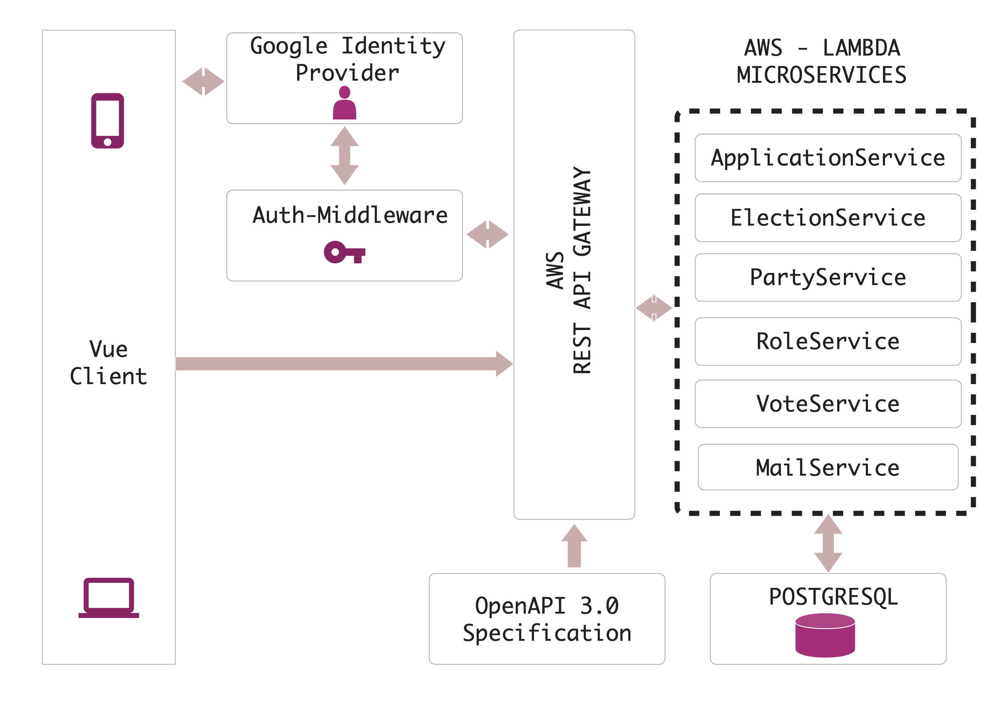

# Software Architektur

VOTO setzt zur besseren Skalierbarkeit auf modernste Cloud-Techniken. Das Gesamtsystem läuft serverless und basiert auf vielen einzelnen Microservices, die einen bestimmten logischen Zweck vom Gesamtsystem abbilden und somit eine höhere Verfügbarkeit und Ausfallsicherheit leisten. Es werden Komponenten der Google Cloud als auch der Amazon Cloud benutzt. Das folgende Diagramm gibt einen groben Überblick über die Architektur.

Alle einzelnen Komponenten werden in diesem Teil der Dokumentation beschrieben.

**Hosting:**

[Google Firebase](https://firebase.google.com) wird für das Hosting aller Webseiten benutzt. Die Web Applikation, der VOTO Builder und das Portal sind mit firebase gehostet. Durch die starke Zu- aber auch Abnahme von Nutzerinnen und Nutzer vor, beziehungsweise nach einer Wahl ist Google Firebase für VOTO die günstigste Möglichkeit, alle Webseiten skalierbar bereitzustellen.

**Frontend:**

- [VueJs](https://vuejs.org)
- [Framework7 UI](https://framework7.io)

Das Frontend orientiert sich an einer klassischen Vue.js App Struktur. Durch die Verwendung des [Framework7](https://framework7.io) im Frontend für Wählende, setzt die WebApp bereits auf Vue.js 3.0, wohingegen die Entwicklung des Frontends für das VOTO Portal noch auf Vue.js 2.0 aufbaut. Der VOTO Builder basiert auf einer React App und ist von den anderen Applikationen abgekapselt.

**Identity Provider / Authentifizierung & Autorisierung:**

Alle Nutzer von VOTO authentifizieren sich mit Google durch die Firebase Authentifizierung. Ein extra dafür entwickelter Microservice [Auth Middleware](https:/github.com/voto-vote/auth-middleware) verwaltet die Authentifizierung cloud-agnostisch. Die Middleware ist im API Gateway von VOTO eingebaut und autorisiert die Anfragen an die API durch das Abfragen der Custom-Claims der Firebase Authentifizierung.

**Backend:**

VOTO profitiert von einem **komplett serverlosen** Backend. Wir benutzen ausschließlich Lambdas, die auf Anfrage aufgerufen werden. Mehr zu AWS Lambdas und Serverless Computing [hier](https://en.wikipedia.org/wiki/Serverless_computing). Dies vereinfacht die zukünftige Skalierung von VOTO und stellt VOTO sicher und kostengünstig zur Verfüugung. Das Backend besteht aus vielen einzelnen Microservices, die an das API Gateway angedockt und in logische Operationen aufgeteilt sind.

| Microservice           | Beschreibung                                                                                                                                                                                                                                                                                                                                                                                                                                                                                                                                                                           |
| ---------------------- | -------------------------------------------------------------------------------------------------------------------------------------------------------------------------------------------------------------------------------------------------------------------------------------------------------------------------------------------------------------------------------------------------------------------------------------------------------------------------------------------------------------------------------------------------------------------------------------- |
| **ApplicationService** | Endpunkte: <ul> <li>/applications</li> <li>/applications/{applicationId}</li> <li>/applications/{applicationId}/theses/{language}</li> <li>/applications/{applicationId}/theses/{language}/{theseId}</li> <li>/clusters/{clusterId}</li> <li>/themes/{themeId}</li> </ul> **Repository:** [ApplicationService](https://github.com/voto-vote/backend-application-service)                                                                                                                                                                                                               |
| **ElectionService**    | Endpunkte: <ul> <li>/elections</li> <li>/elections/{electionId}</li> </ul> **Repository:** [ElectionService](https://github.com/voto-vote/backend-election-service)                                                                                                                                                                                                                                                                                                                                                                                                                    |
| **PartyService**       | Endpunkte: <ul> <li>/applications/{applicationId}/matches/parties</li> <li>/applications/{applicationId}/matches/parties/{partyId}</li> </ul> **Repository:** [PartyService](https://github.com/voto-vote/backend-party-service)                                                                                                                                                                                                                                                                                                                                                       |
| **RoleService**        | Endpunkte: <ul> <li>/users</li> <li>/users/{userId}</li> <li>/admins</li><li>/admins/{adminId}</li> <li>/applications/{applicationId}/roles/creator</li> <li>/applications/{applicationId}/roles/creator/{creatorId}</li> <li>/applications/{applicationId}/roles/trustpersons</li> <li>/applications/{applicationId}/roles/trustpersons/{trustPersonId}</li> <li>/applications/{applicationId}/matches/candidates</li> <li>/applications/{applicationId}/matches/candidates/{candidateId}</li> </ul> **Repository:** [RoleService](https://github.com/voto-vote/backend-role-service) |
| **VoteService**        | Endpunkte: <ul> <li>/applications/{applicationId}/matches/candidates/{candidateId}/votes</li> <li>/applications/{applicationId}/matches/parties/{partyId}/votes</li> </ul> **Repository:** [VoteService](https://github.com/voto-vote/backend-vote-service)                                                                                                                                                                                                                                                                                                                            |
| **MailService**        | Der MailService wird nicht direkt durch einen API Endpunkt angesprochen. Stattdessen wird dieser von anderen Microservices angetriggert. Dies geschieht durch den Simple Notification Service, der eine Verbindung zwischen den Microservices erlaubt.                                                                                                                                                                                                                                                                                                                                 |

Die meisten Microservices werden durch einen Aufruf im API Gateway gestartet. Allerdings gibt es zusätzlich auch Funktionen, die regelmäßig aufgerufen werden, um beispielsweise Daten abzusichern. Mehr Information und Dokumentation ist jeweils bei den einzelnen Microservices zu finden.
