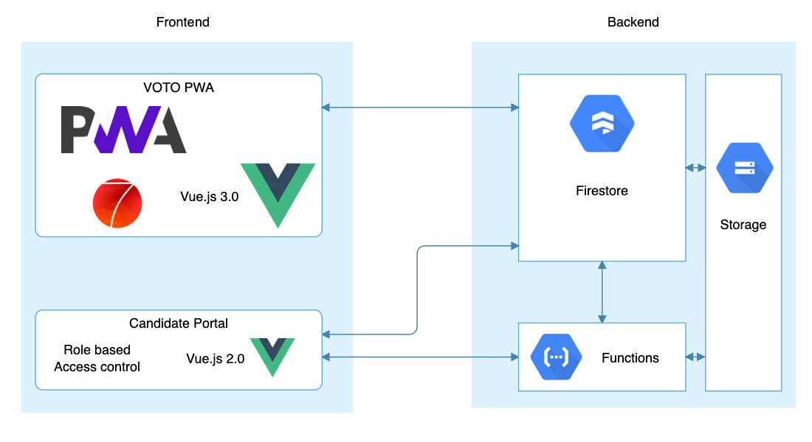
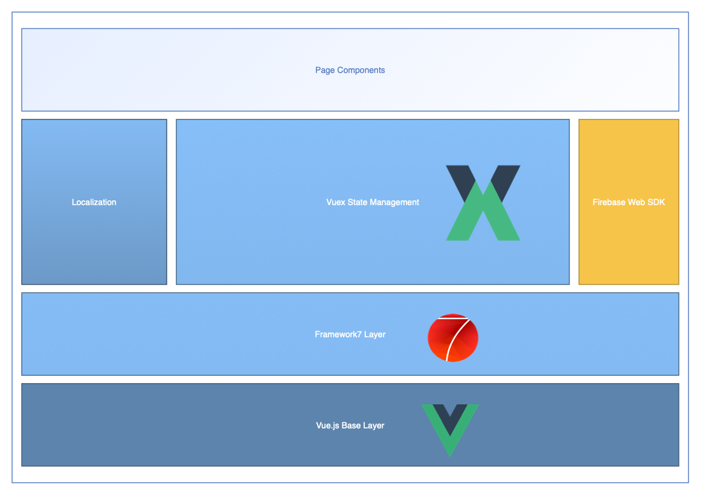
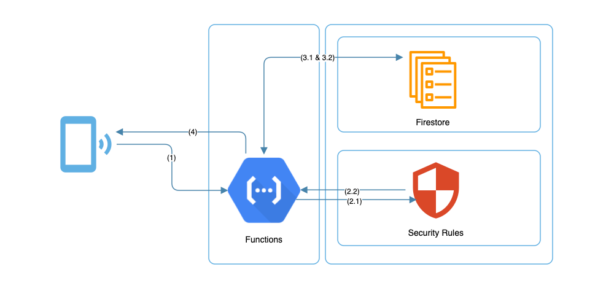
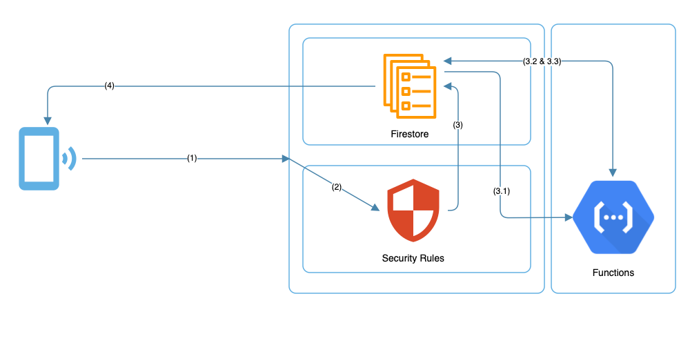
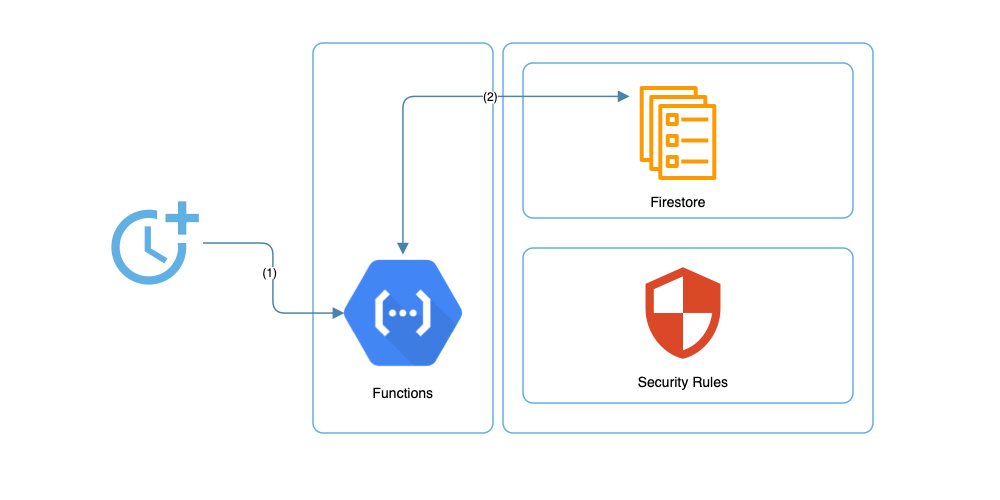

# Software Architektur

## Technologie Stack

VOTO setzt auf die Google Cloud Firebase Lösung. Folgende Tools werden weiterhin im Gesamstsystem eingesetzt:

**Hosting/Backend:**

- [Google Firebase](https://firebase.google.com)
- [Google Cloud Functions](https://cloud.google.com/functions?hl=de)

**Frontend:**

- [VueJs](https://vuejs.org)
- [Framework7 UI](https://framework7.io)

Sowohl Frontend als auch Backend sind in Javascript und TypeScript geschrieben.

Die folgende Übersicht zeigt die grobe Architektur und Aufteilung der Software Komponenten:

## Frontend

Das Frontend orientiert sich an einer klassischen Vue.js App Struktur. Durch die Verwendung des [Framework7](https://framework7.io) im Frontend für Wählende, setzt die WebApp bereits auf Vue.js 3.0 wohingegen die Entwicklung des Frontends für das Kandierendenportal noch auf Vue.js 2.0 aufbaut.

Der Aufbau des Frontends für die WebApp lässt sich in einer Grafik darstellen:

## Backend

VOTO profitiert von einem **komplett serverlosen** Backend. Wir benutzen ausschließlich Functions, die auf Anfrage aufgerufen werden. Mehr zu Functions und Serverless Computing [hier](https://en.wikipedia.org/wiki/Serverless_computing). Dies vereinfacht die zukünftige Skalierung von VOTO.

Dadurch gibt es verschiedene Subkomponenten im Backend, die verschieden aufgerufen werden.

#### Anfrage der App auf Daten mit Firestore

Klassisch können Daten mit dem Javascript Firebase Web SDK geladen werden. Diese Aufrufe finden bei allen kontrollierbaren Aufrufen statt, die keinen speziellen Zugriff auf bestimme Collections benötigen. Als Beispiel wird in der folgenden Grafik beschrieben, wie Wahlen geladen werden:

- **(1)** Das Frontend nutzt das Firebase Javascript SDK und stellt eine Anfrage direkt an Firebase.
- **(2/3)** Firebase prüft anhand der Security Rules für Firestore Collections, ob die Anfrage gültig ist. Ist dies der Fall, wird die Anfrage durchgelassen.
- **(4)** Firebase liest die angefragten Daten aus der Firestore Collection `elections` aus und gibt diese zurück an das Frontend.

---

#### Anfrage der App auf Daten mit Functions

Bei Anfragen, die entweder nur bestimmte Nutzer durchführen dürfen, oder die sich je nach Rolle unterschiedlich verhalten soll, oder die zusätzliche Rechenleistungen benötigt ( vote - matching Algorithmus ), wird eine Function aufgerufen.

- **(1)** Das Frontend nutzt das Firebase Javascript SDK und stellt eine Anfrage an eine Function.
- **(2.2 & 2.2)** Auf Basis von Custom User Auth Claims wird entschieden, ob die Anfrage gültig ist. Dies kann beispielsweise die Überprüfung der Rolle des Nutzers sein, der die Anfrage stellt.
- **(3)** Nachdem die Anfrage gültig ist, können Daten von Firestore geladen und anschließend in der optionalen zusätzlichen Berechnung innerhalb der Function weiterverarbeitet werden.
- **(4)** Dem Nutzer wird, je nach Verarbeitung die gewünschte Antwort zurückgegeben.

---

#### Anfrage der App auf Daten mit Firestore und geplanten Functions

Manchmal ist es notwendig, Datenbankeinträge zu synchronisieren. Beispielsweise wird das Alter von Kandidierenden im öffentlichen Profil angezeigt. Dies geschieht auf Basis der privaten `User` Collection und deren Geburtstag Attribut. Öffentliche Nutzer sollen jedoch nur das Alter, nicht das konkrete Geburtsdatum sehen können - es ist also eine Verarbeitung notwendig. Nachdem nun ein Nutzer sein Geburtsdatum geändert hat und erkannt wurde, dass dieser Nutzer auch bei einer anstehenden Wahl kandidiert, wird eine Function aufgerufen, die das öffentliche Profil synchronisiert beziehungsweise das Alter errechnet. Dieser Prozess stellt sicher, dass private Informationen und öffentliche Informationen sicher getrennt sind und trotzdem auf Wunsch Daten synchronisiert werden können.

- **(1)** Das Frontend nutzt das Firebase Javascript SDK und stellt eine Anfrage an Firebase.
- **(2/3)** Firebase prüft anhand der Security Rules für Firestore Collections, ob die Anfrage gültig ist. Ist dies der Fall, wird die Anfrage durchgelassen.
- **(3.1 & 3.2)** Eine Function wird durch den Lese- oder Schreibvorgang aufgerufen. Im Beispiel des angemerkten Geburtsdatum wird das Alter daraufhin berechnet und im öffentlichen profil eingetragen.
- **(4)** Der Nutzer erfährt nicht von der zusätzlichen Ausführung einer Function. Firestore wartet nicht auf die Beendigung der angestoßenen Function.

---

#### Geplante, regelmäßige Aufrufe

Backups werden nicht durch Anfrage sondern zeitbasiert durcheführt. So wird sichergestellt, dass regelmäßig Daten gesichert sind.

- **(1)** Eine Function wird durch ein Zeitevent aufgerufen (ähnlich zu CronJobs)
- **(2)** Verarbeiten der Daten, Ausführen der Function und Schreiben in Firestore
