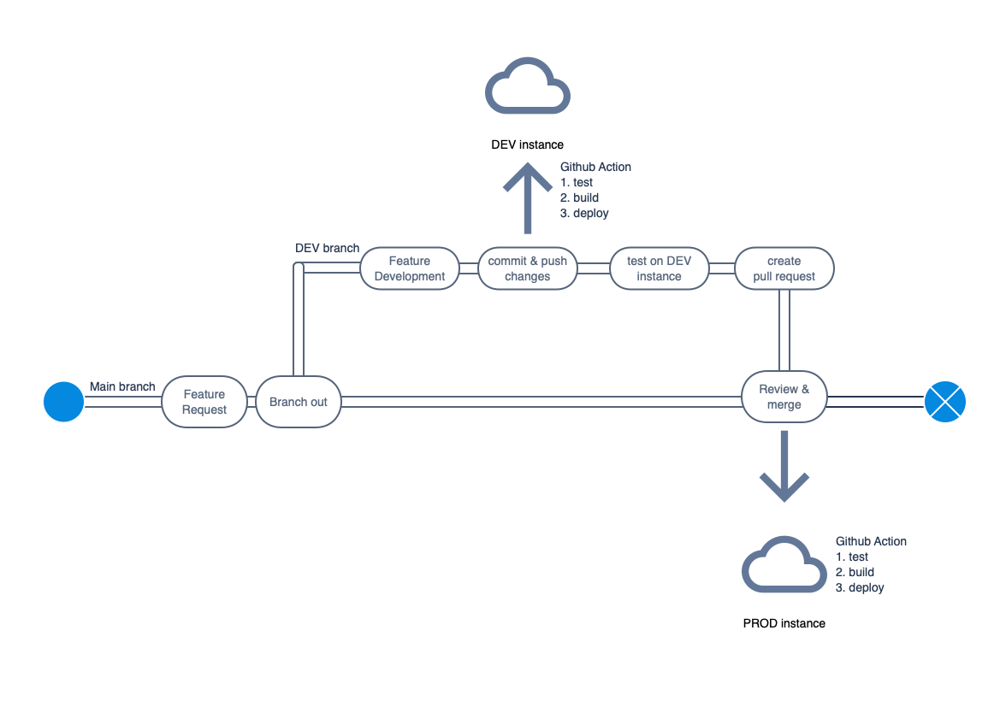

# VOTO CI/CD

Für die kontinuierliche Weiterentwicklung sowohl im Kandidierendenportal als auch in der WebApp benutzen wir [GitHub Actions](https://github.com/features/actions). Das Grundgerüst bilden zwei Branches (`main` und `dev`). Unsere produktive Umgebung befindet sich auf dem `main` Branch, unsere Entwicklungsumgebung auf dem `dev` Branch. Wenn wir neue Features entwickeln, werden diese stets auf dem `dev` Branch entwickelt und getestet. Wenn alle geplanten Features fehlerfrei laufen, wird ein Merge Request auf den `main` Branch geöffnet. Sobald der Merge request akzeptiert wurde, deployed eine GitHub Action die neue Version auf die Produktivumgebung.

Folgende Grafik stellt den Flow dar:

Die Instanzen (`dev` und `prod`) sind komplett voneinander getrennt - es werden unterschiedliche Datenbanken benutzt.
