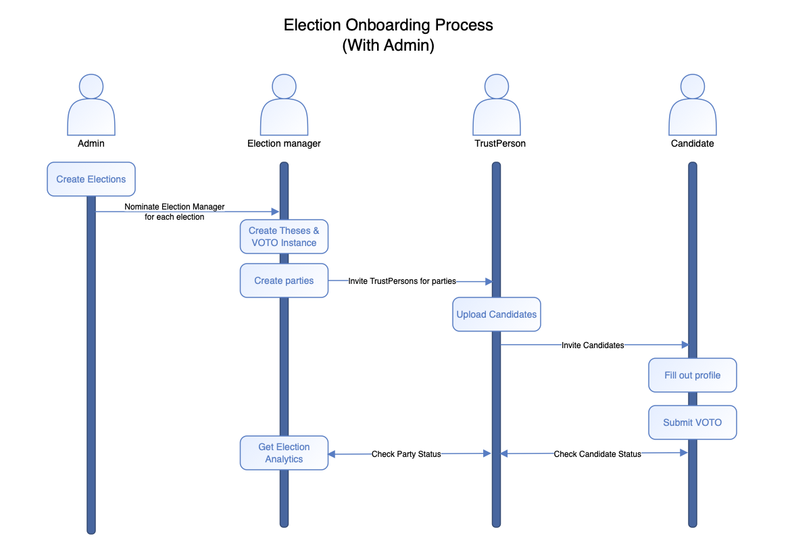
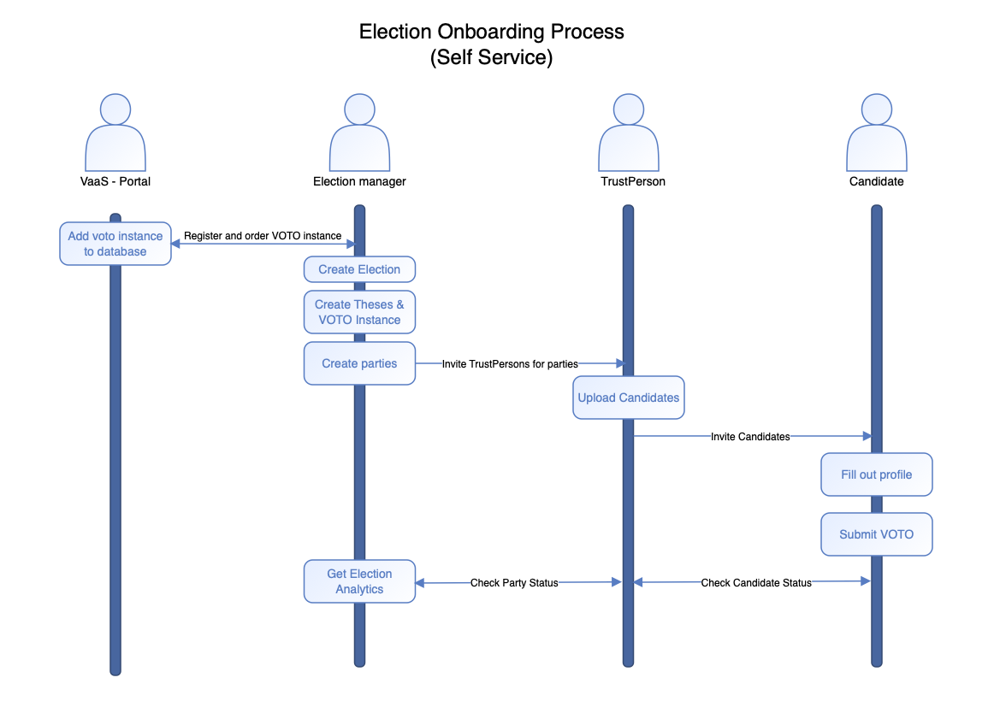

# VOTO as a Service

VOTO ist mehr als nur ein Wahlhelfer. Zukünftig wird es möglich sein VOTO als Service zu buchen. Das Rollenkonzept von VOTO sieht bereits die skalierbare Erstellung neuer VOTO Instanzen vor.
Nachfolgend werden zwei Prozesse beschrieben. Der erste davon beschreibt den aktuellen Entwicklungsstand. Der zweite Prozess richtet sich an dem Konzept des selbstbestellbaren VOTO aus.

## VOTO Onboarding Process - Stand 03.21

Folgende Grafik zeigt die Rollenabhängigkeiten und Prozesse einer neuen VOTO Instanz.

- **(1)** Ein Admin pflegt anstehende Wahlen in das System ein. Dazu bietet VOTO bereits jetzt eine Nutzeroberfläche.
- **(2)** Der nächste Schritt sieht vor, dass ein Admin einen Wahlleiter für eine bestimmte Wahl nominiert. Dieser Wahlleiter hat die Möglichkeit eine VOTO Instanz zu erstellen. Dies beinhaltet sowohl die Erstellung der Thesen als auch jegliche weitere Indidivualisierung, wie zum Beispiel die Auswahl von: eigenen Farben und Logo, Größe der Wahl, Darstellung der Matches, Lokalisierung und Übersetzung der Thesen in verschiedene Sprachen. Zusätzlich ist die Aufgabe des Wahlleiters, Parteien beziehungsweise Listen zur Instanz hinzuzufügen. Sind die Listen erstellt, können daraufhin Vertrauenspersonen für diese Listen eingeladen werden.
- **(3)** Vertrauenspersonen sind nun die authentifizierte Rolle für Ihre Partei/Liste. Sie haben die Verantwortung, Kandidierende Ihrer Wahl zu VOTO einzualden. Dieser Schritt stellt sicher, dass lediglich reale Kandidierende zu VOTO eingeladen werden.
- **(4)** Kandidierende können nun auf Ihre Einladung reagieren und sich genau wie alle anderen Rollen auf [https://portal.voto.vote](https://portal.voto.vote) einloggen. Dort haben Kandidierende nun die Möglichkeit Ihr Profil auszufüllen und VOTO zu beantworten
- **(5)** VOTO bietet Vertrauenspersonen und Wahlleitern an, Analytics zur ihren Kandidierenden bzw. zu ihrer Wahl einzusehen. Es können Daten wie: `Wie oft wurde VOTO für meine Wahl benutzt?`, `Welche meiner Kandidierenden haben welchen Status?` `Wie stehe ich mit meiner Liste im Vergleich zu anderen?`

---

## VOTO Onboarding Process - Self Service

Im Vergleich zum bisherigen Prozess, sieht der Self Service eine eigene Erstellung der Wahl vor. Wahlleiter können nun komplett im Selbst-Service VOTO Instanzen erstellen. Dies ermöglicht eine grenzenlose Skalierung von VOTO über alle Wahlen hinweg.

- **(1)** Ein Wahlleiter bestellt VOTO und erstellt dabei eine Wahl.
- **(2)** Der nächste Schritt sieht vor, dass ein Admin einen Wahlleiter für eine bestimmte Wahl nominiert. Dieser Wahlleiter hat die Möglichkeit eine VOTO Instanz zu erstellen. Dies beinhaltet sowohl die Erstellung der Thesen als auch jegliche weitere Indidivualisierung, wie zum Beispiel die Auswahl von: eigenen Farben und Logo, Größe der Wahl, Darstellung der Matches, Lokalisierung und Übersetzung der Thesen in verschiedene Sprachen. Zusätzlich ist die Aufgabe des Wahlleiters, Parteien beziehungsweise Listen zur Instanz hinzuzufügen. Sind die Listen erstellt, können daraufhin Vertrauenspersonen für diese Listen eingeladen werden.
- **(3)** Vertrauenspersonen sind nun die authentifizierte Rolle für Ihre Partei/Liste. Sie haben die Verantwortung, Kandidierende Ihrer Wahl zu VOTO einzualden. Dieser Schritt stellt sicher, dass lediglich reale Kandidierende zu VOTO eingeladen werden.
- **(4)** Kandidierende können nun auf Ihre Einladung reagieren und sich genau wie alle anderen Rollen auf [https://portal.voto.vote](https://portal.voto.vote) einloggen. Dort haben Kandidierende nun die Möglichkeit Ihr Profil auszufüllen und VOTO zu beantworten
- **(5)** VOTO bietet Vertrauenspersonen und Wahlleitern an, Analytics zur ihren Kandidierenden bzw. zu ihrer Wahl einzusehen. Es können Daten wie: `Wie oft wurde VOTO für meine Wahl benutzt?`, `Welche meiner Kandidierenden haben welchen Status?` `Wie stehe ich mit meiner Liste im Vergleich zu anderen?`

---
