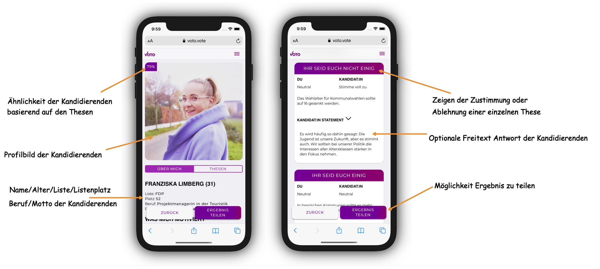

## VOTO für Kandidierende

VOTO ist nicht nur für Wählende gedacht. Kandidierende haben die Möglichkeit sich potenziellen jungen Wählenden digital zu präsentieren. Kandidierende können Ihr Profilt über alle Kanäle teilen und somit allen Bürger und Bürgerinnen Ihre Statements leicht zugänglich machen.

### User Journey

1. **Einladung durch Vertrauensperson bei VOTO:**
   Das Team VOTO sendet allen sogenannten Vertrauenspersonen ([mehr zu den Rollen und Berechtigungen](./docs/UserRoles.md)) Einladungen. Durch die Einladung erhalten die Vertrauenspersonen der Parteien Zugriff auf den Upload der Kandidierenden für genau ihre Liste. Dieser Prozess sichert die Authentizität der Kandidierenden ab, da nur Vertrauenspersonen Kandidierende einladen können und somit Kandidierende nicht sich selbst ohne Vertrauensperson einladen können.

2. **Login im VOTO Kandidierendenportal:**
   Nachdem nun Kandidierende eingeladen sind, können Sie sich mit Ihrer Mailadresse im [VOTO Kandidierendenportal](https://portal.voto.vote) anmelden.

3. **Beantworten der Thesen:**
   Nach einem kurzen Onboarding mit Erklärvideo, können Kandiderende nun VOTO für die jeweilige Wahl durchspielen. Sie bekommen die gleichen Thesen wie Bürger und Bürgerinnen. Kandidierende haben jedoch zusätzlich die Möglichkeit optionalen Freitext als Antwort auf jede Thesen hinzuzufügen. Dies erlaubt eine weitere Erklärung und Individualisierung in VOTO.

4. **Individualisierung des Profils:**
   VOTO erlaubt es Kandidierenden, ein Profilbild Ihrer Wahl, sowie ein 150 Zeichen langes Motto hochzuladen. Damit können Kandiderende sich zusätzlich individualisieren und potenziellen Wählern Einblicke in Ihre politische Motivation geben.

Ein fertiges Profil eines Kandidierenden wird nun den Wählenden folgendermaßen präsentiert:

