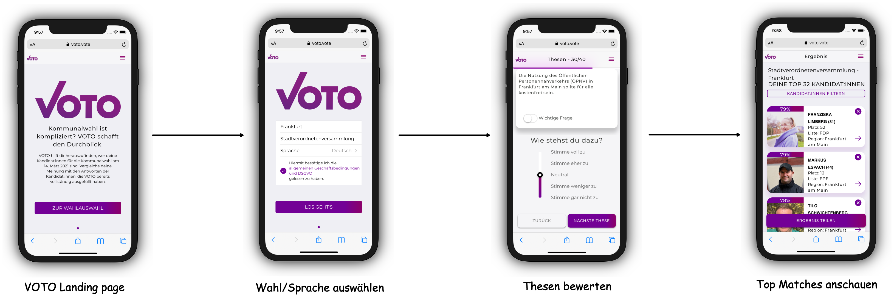

## VOTO für Wählende

VOTO bietet Wählenden die Möglichkeit, mit nur wenigen Klicks eine übersichtliche Darstellung Ihrer Top Matches zu bekommen.

### User Journey

1. **Wahl/Sprache auswählen:**
   VOTO bietet die Möglichkeit mit nur wenig Aufwand eine neue Wahl anbieten zu können. Nutzer können dann Standortspezifisch eine Wahl und Sprache auswählen. Momentan bietet VOTO für alle Wahlen 7 Sprachen an. (Deutsch, Deutsch - Einfache Sprache, Englisch, Russisch, Türkisch, Arabisch und Italienisch)

2. **Thesen bewerten:**
   Der Nutzer kann mit einem Slider seine Zustimmung bzw. seine Ablehnung ausdrücken. Es gibt grundsätzlich 5 Stufen: `Stimme voll zu`, `Stimme eher zu`, `Neutral`, `Stimme weniger zu`, `Stimme gar nicht zu`. Zusätzlich kann der Nutzer eine These für besonders wichtig einstufen. In diesem Fall wird die Antwort doppelt gewichtet. Mehr dazu in der Sektion [Matching Algoritmus](./algorithm.md).

3. **Top Matches anschauen:**
   Je nach Wahl gibt es unterschiedlich viele Thesen. Wir empfehlen eine Thesenanzahl zwischen 20 und maximal 40. Nachdem zu mindestens einer These Stellung bezogen wurde ( Nicht Neutral ) wird das Ergebnis der Abstimmung mit allen Kandidierenden, die ebenfalls Stellung zu den Thesen bezogen haben, verglichen und nach Matching absteigend sortiert.
