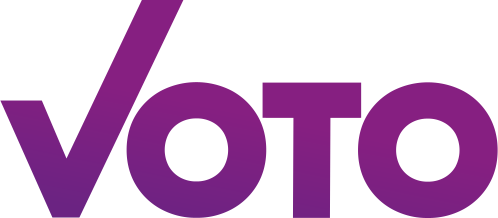

<!-- PROJECT LOGO -->
 

  

  <h3 align="center">Voting made easy</h3>

<!-- TABLE OF CONTENTS -->

  
Table of contents

  <ol>
    <li>
      <a href="#what-is-voto">What is VOTO?</a>
    </li>
    <li>
      <a href=". /docs/votoforvoters.md">VOTO for voters</a>
    </li>
    <li>
      <a href="./docs/votoforcandidates.md">VOTO for candidates</a>
    </li>
    <li>
      <a href=". /docs/architecture.md">VOTO Software</a>
      <ul>
        <li><a href="./docs/cicd.md">CI/CD</a></li>
        <li><a href="./docs/algorithm.md">Match Algorithm</a></li>
        <li><a href=". /docs/roles.md">Role concepts</a></li>
      </ul>
    </li>
    <li><a href="./docs/vaas.md">VOTO as a Service</a></li>
  </ol>

## What is VOTO?

[VOTO](https://voto.vote) is a politically neutral digital voting advise application.
Citizens can find out about the parties' and candidates' stances on political issues for the upcoming election and see who is closest to them on political issues.
